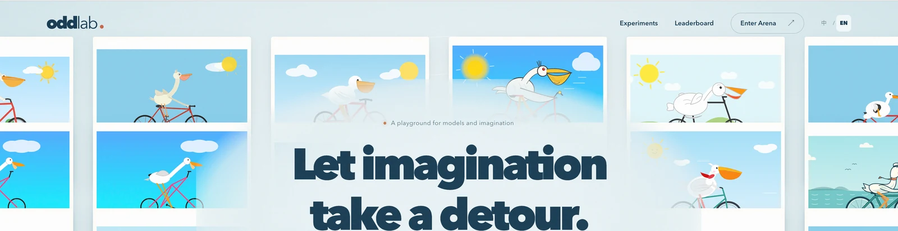

# Odd Lab · 趣味模型实验室

[在线体验](https://odd-lab-bay.vercel.app) · [GitHub](https://github.com/minghong-X/odd-lab)

<p align="center">
  
</p>

让想象力出个小差。从骑自行车的鹈鹕，到骑摩托的鳄鱼，再登上星舰飞往火星。一个无需登录的模型作品展览与 Arena，使用 Next.js 全栈架构，适合部署到 Vercel。

## 已实现

- 原创照片墙入场、滚动公路故事、星舰剖面/登船/发射、火星终幕，支持移动端和减少动态效果。
- 29 个真实鹈鹕模型作品的本地展示预览，实验详情与画廊。
- 无账户左右盲测、放大、左胜/右胜/平局/都不好、投票后揭晓模型。
- PostgreSQL 持久投票和 Elo 排名；同一场对战重复提交只计一次。
- 数据库行锁、配对凭证、过期检查、共享请求限流，保留评分事件。
- 鳄鱼和星舰实验入口；真实模型作品尚未提供，页面明确显示准备中，叙事插画不参与排名。

## 本地运行

需要 Node.js 22+。

```bash
npm ci
npm run dev
```

打开终端显示的地址（默认 `http://localhost:3000`）。不配置数据库时，**仅开发环境**会使用 `.local-db/` 下的 PGlite 持久保存投票；它兼容 PostgreSQL，便于零配置开发。不需要注册或登录。

素材已经随仓库包含，首次运行无需访问素材源站。依赖由 npm 公共 registry 安装，网页不加载外部字体、图库或网络背景图。

要使用自己的 PostgreSQL，可复制 `.env.example` 为 `.env.local` 并配置 `DATABASE_URL`。迁移 CLI 使用 shell 环境变量（也可用 Node 的 `--env-file=.env.local`），不会自动读取 Next.js 的环境文件：

```bash
node --env-file=.env.local --import tsx scripts/migrate.ts
npm run dev
```

## Vercel 部署

1. 将仓库推送到自己的 GitHub，然后从 Vercel 导入，框架选择 Next.js。
2. 创建 PostgreSQL（例如 Neon），配置 `DATABASE_URL`。函数和数据库尽量同地区。
3. 对目标数据库运行上面的迁移命令，之后部署。`npm run build` 不会自动迁移或改写生产数据库。
4. 生产环境设置 `APP_ORIGIN` 为最终站点 origin（不带结尾 `/`）。Preview 使用独立数据库并设置对应 origin，或留空以使用当前请求 origin。
5. 构建命令 `npm run build`，Node.js 使用平台支持的 22+ 版本。

**生产环境必须配置 PostgreSQL。** 不提供文件数据库回退，避免在 Serverless 临时磁盘上丢失投票。本站已连接 Vercel 与 Neon PostgreSQL。Fork 部署时请创建自己的数据库并配置连接串；当前生产连接仅提供给 Production，Preview 需要配置独立数据库。原始动态 SVG 和 WebP 静态预览随部署打包；以后可迁移到对象存储，当前运行不依赖 OSS 可用性。

## 验证

```bash
npm run typecheck
npm test
npm run build
```

浏览器测试使用端口 3101、`.next-test/` 构建目录与 `.test-db/` 数据库，不影响正常预览数据：

```bash
npx playwright install chromium
npm run test:e2e
```

如已有 Chrome，可通过 `PLAYWRIGHT_BROWSER_PATH` 指定可执行文件，免下载测试浏览器。测试涵盖桌面与手机的首页、完整投票、图片放大、揭晓、排行榜和减少动态效果。

## 导入作品

```bash
npm run import:materials
npm run import:materials -- data/source-crocodile.json
```

读取用户提供的 `data/source-results.json`，从明确允许的 OSS 主机验证 HTTPS 并导入，检查 SVG 活动/外部内容、体积和渲染像素数，保留原始动态 SVG，并生成中性文件名的 WebP 静态预览与 `data/catalog.json`。运行会访问附件给出的原始模型作品地址，不获取网络图库。失败详情写入 `data/import-report.json`，失败时退出码非零。导入采用增量合并，保留已有作品 ID 和目录记录，不覆盖投票。

作品 ID 根据实验、模型、源记录和内容版本生成；文件按内容去重。两个模型可以生成相同文件，但评分独立。旧 Elo、胜负统计均未导入，新站从 1500 分起算。

## 排名规则

- 所有人直接投票，不创建用户或匿名账户。
- 左胜/右胜/平局使用 Elo（初始 1500，K=32）。都不好增加拒绝计数，不改变 Elo；换一组不记票。
- 同一对战只提交一次，可以继续申请新对战。不保证一人一票。
- 页面隐藏 Elo 数值，计算仍使用 Elo。每实验独立排名；不足 20 场显示暂定。榜单只表达这组作品的偏好，不等同于模型整体能力。
- 现有 29 份鹈鹕作品和 27 份鳄鱼作品，同一模型可能有多份输出，原始完整提示词与采样参数没有记录。
- 模型名不会进入盲测配对响应；图片经凭证校验后以 Blob 展示，提交后才揭晓。画廊本身公开，熟悉作品的人仍可能识别画面。

## 素材来源与文件

- `src/components/art.tsx`：原创分层 SVG 鹈鹕、自行车、鳄鱼、摩托、星舰和引擎示意。
- `public/story/mars.webp`：内置 ImageGen 原创生成的火星背景，未使用网络图片。完整提示词在 [docs/mars-background-prompt.txt](docs/mars-background-prompt.txt)。
- `data/media/`：用户提供的模型原始动态 SVG 与转换后的 WebP 静态预览，属于实验数据，区别于首页叙事插画。
- [docs/implementation.md](docs/implementation.md)：当前实现和后续范围。
- [docs/architecture.md](docs/architecture.md)、[docs/experience.md](docs/experience.md)：原始架构与分镜方案，包含后续规划。

应用代码与手绘 SVG 使用 MIT 许可证。用户提供的模型实验数据单独保留其来源，不将代码许可证自动扩展到第三方模型输出。星舰剖面是艺术示意，不是工程图纸。

## 中英文与登船动画

右上角可切换中文 / English，默认英文。配置位于 `src/i18n/locales/{zh,en}/`，按 common、story、experiments、arena、rank、errors 拆分；新增文案需在两种语言中添加相同键。类型约束与测试会检查键名和插值参数。原始作品中的文字和模型名称保留原样。

`odd-lab-lang` 同时保存到 Cookie（用于服务端首次渲染）与 localStorage（浏览器记忆和跨标签同步）。切换语言只刷新服务端文案，当前盲测图片、已揭晓结果和本次投票数保留。API 错误提供稳定 `code` 与当前语言 `error`，客户端按 code 展示，以便已有错误同步切换。

登船使用 `boarding-scene.tsx` 的共用 SVG 坐标系与 `story.tsx` 的 GSAP 时间线，以地面准备、舰内就座、关门起飞三个分镜表现。保留星舰与可开合舱门，移除升降台、人物穿行路线和作用在地面角色上的舱门遮罩。人物通过短淡出切换到舷窗镜头，上滑可反向还原。减少动态效果时使用静态构图。浏览器回归直接检测出场时鳄鱼鼻部的实际可见性，同时覆盖人物不重叠、镜头切换、起飞与倒放。

首屏使用全部 29 张模型作品，按八个方向飞入并在约 3.5 秒后定格为照片墙。每次打开首页均播放，可使用“重播开场”再次观看；减少动态效果时直接显示静态墙。两位角色沿同一方向从左向右进入公路，保持错开的距离。照片墙回归检查实际移动、行列分布、重复访问、手动重播和减少动态效果。

## 模型作品动画

首页照片墙、Arena 及放大查看使用原始 SVG 内的 SMIL / CSS 动画，照片飞入并定格后，作品仍会继续播放。实验图库也展示动态 SVG；排行榜缩略图保留 WebP。开启系统“减少动态效果”时，首页自动切换静态预览，Arena 在加载下一对作品时使用静态预览。

SVG 仅通过图片元素展示，不注入页面 DOM；媒体响应设置 CSP 沙箱和 `nosniff`，盲测图片仍需要对局令牌且禁止缓存。原始内容按哈希保存，不添加或改写模型动画。动画格式切换不改变作品 ID、已有投票或排名。

首页照片墙从各实验交错选取最多 30 份作品，保持 6 × 5（手机 5 × 6）构图。首屏移除进入盲测和探索实验按钮，保留向下滚动提示；导航及下方实验卡片仍可进入各实验。

`data/source-crocodile.json` 来自用户 2026-09-11 提供的附件，仅包含 27 份鳄鱼作品；附件中误标为 `pelican` 的分类已按 `-crocodile-motorcycle` 作品名纠正为 `crocodile`，不导入附件中的历史评分。
