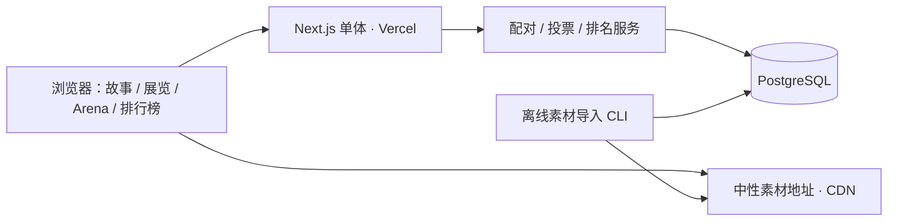

# 产品与架构方案

本方案是设计建议，尚未实现。目标：一个适合 GitHub 开源、部署到 Vercel 的趣味 AI 实验网站，兼具沉浸式展览、左右盲测、公开榜单。首版不设登录、账户或个人评价历史。默认首期由站长导入作品，访客浏览和投票；开放投稿后续再加入。

## 1. 核心决策

**Node.js 可以完成前后端业务。推荐 Next.js 全栈单体：一个代码仓库、一个应用部署、同源访问。** 浏览器负责动效，Node.js 负责作品查询、配对、投票和统计。持久数据保存在外部 PostgreSQL，素材存放对象存储；这不要求前后端拆成两个项目。

| 层次       | 首选                                   | 用途与取舍                                                                     |
| ---------- | -------------------------------------- | ------------------------------------------------------------------------------ |
| 应用       | Next.js App Router + TypeScript        | 服务端渲染展览与榜单，客户端承载 Arena 和滚动故事；Route Handlers 提供同源接口 |
| 运行环境   | Node.js，部署 Vercel                   | 首期只用常规请求处理；应用实现时采用平台支持的 LTS 和稳定依赖并锁定版本        |
| 数据       | Neon PostgreSQL + Drizzle              | 投票、作品、排名持久化；连接池适配函数实例；本地用 PostgreSQL                  |
| 视觉       | GSAP + ScrollTrigger，CSS/SVG 分层场景 | 统一控制照片墙与滚动分镜；React 管状态，GSAP 管逐帧变换                        |
| 基础 UI    | CSS Modules + CSS variables            | 视觉定制优先；表单和弹层可复用无样式可访问组件                                 |
| 素材       | 初期沿用 OSS 的 HTTPS 资源             | 导入后使用中性资源键；数据库保存元数据；部署地区变化时评估 Vercel Blob 或 R2   |
| 校验与检查 | Zod + Vitest + Playwright              | 导入和 API 输入校验；重点覆盖投票校验、事务、盲测和移动端                      |

暂不引入 NestJS、独立 Express 服务、微服务、实时 WebSocket、完整 Three.js 场景或专用 Redis。并发增长后再按测量结果引入队列、缓存和独立统计作业。Vercel/Next.js、连接池及动效的一手资料见 [research.md](research.md)。



## 2. 页面结构

| 页面     | 路径                  | 内容                                                               |
| -------- | --------------------- | ------------------------------------------------------------------ |
| 首页故事 | `/`                   | 照片汇聚 → 两位主角 → 星舰剖面 → 登船 → 火星；始终能跳过并进入实验 |
| 实验目录 | `/experiments`        | 每个实验有主题、任务说明、作品数、参与入口；支持未来扩展           |
| 实验详情 | `/experiments/[slug]` | 相同提示词、样本集/版本、作品画廊、生成耗时、进入盲测              |
| Arena    | `/arena/[slug]`       | 左右对比、放大查看、选择、揭晓、下一组                             |
| 排行榜   | `/leaderboard/[slug]` | 该实验作品排名、有效对战数、暂定/可信度说明                        |

实验使用配置化的 `slug / title / prompt / protocol / mediaKind / judgingCriteria / storyChapter / cover`；新增实验不改 Arena 核心逻辑。首期支持 SVG 与静态图片，未来扩展短视频、HTML/交互演示；后者必须独立沙箱，不能作为普通图片直接插入。

## 3. Arena：公平地收集偏好

一次流程：选择实验 → 服务端发出配对 → A/B 图片加载完成 → 用户选择 → 事务提交成功 → 揭晓模型 → 下一组。

- 按钮为 **左边更好 / 右边更好 / 平局 / 都不好**，另有跳过。左右胜更新偏好评分；平局计 0.5；都不好单独统计拒绝率，不更新 Elo；跳过不计评分。
- 同一实验、同一评测协议、兼容的媒介和展示条件才能配对。首期模型间比较只配不同模型，优先覆盖新作品与曝光不足的作品，再混合随机与分数接近的对手。
- 左右位置服务端随机；发出的配对记录保存实际左右映射，客户端只回传 `battleId + battleToken + choice`；battleToken 是该场对战的随机凭证，不是账户或用户身份。
- 未投票前不返回模型名、分数、耗时、原始 SVG URL，也不把这些信息塞进隐藏 DOM、预加载数据、RSC payload 或 HTML 注释。
- 盲测接口只提供不可推断的资源标识。资源服务校验配对凭证后返回数据，禁止重定向至含模型名的源地址；素材自身的签名、水印、文字也要人工审核。相同画面仍可能被熟悉作品的用户识别，盲测降低标签偏见，无法保证作品不可识别。
- 两张图相同背景、可比较尺寸和缩放方式，不裁掉内容；并排看清细节。移动端保留 A/B 标签，采用上下展示或固定视口切换，选择按钮固定在底部。
- 所有人直接投票，全部通过校验的票均计入对应统计，不区分游客票与账户票；胜负和平局更新 Elo，都不好计入拒绝率。

## 4. 评分与“展示最好的”

首期做**每个实验的作品榜**。你目前每个模型只有一张鹈鹕图，这样只能说明这些具体样本更受欢迎；不足以说明模型的整体生成能力。模型榜应在每个实验包含多个任务/提示词、每模型多个样本并平衡曝光后再推出；跨实验汇总需明确权重，不能直接把不同榜的 Elo 混加。

作品初始 Elo 1500，首期固定 K=32。`EA = 1 / (1 + 10^((RB - RA)/400))`；`RA' = RA + K*(SA-EA)`；B 对称更新。胜=1、负=0、平=0.5。保留算法版本、每次更新记录和输入票据，支持按 `acceptedAt, voteId` 确定顺序重放；批量回放或剔除作弊票后发布新的排名快照。

榜单展示 Elo、有效对战数、不同对手数和数据更新时间。建议初期设立可配置入榜门槛，例如至少 20 场有效对战、5 个不同对手；门槛仅为产品初值，并非统计置信保证。样本不足显示“暂定”。后续有足够数据时可计算 bootstrap 区间或采用 Bradley–Terry 模型。

首页的“当前人气作品”读取已发布快照，不随每一票跳动；少样本期使用明确标注的“编辑精选”。不把低样本分数包装成“最强模型”。

## 5. 无账户开放投票

首版不引入认证库、不创建用户/会话/OAuth 表，也不提供“我的评价”。访客进入 Arena 就能开始投票，排名只依赖有效投票事件。账户与个人历史留待后续版本。

服务端生成随机配对及高熵 battleToken，仅保存 tokenHash。提交、素材访问和揭晓接口通过请求头或请求体携带该凭证，避免放入 URL 或访问日志。它只证明客户端持有这场配对，不标识一个人；相关响应不进入共享缓存。配对建议 15 分钟内可投票，已成功提交的相同选择重试返回原结果，不能再计分；提交不同选择返回冲突。

保留同一 battle 只能提交一次、输入校验和基础请求限流。不按用户或浏览器对作品对去重，也不承诺“一人一票”：任何人可以继续申请新配对并投票，公开榜单反映累计投票偏好。

后续增加账户时，可通过数据库迁移为新投票添加可空 userId；已有票保留为无归属历史票并继续参与统计，不猜测或追溯归属，也不要求本期提前搭建账户体系。

## 6. 数据模型与并发约束

| 实体                     | 关键内容                                                                                         |
| ------------------------ | ------------------------------------------------------------------------------------------------ |
| `Experiment`             | slug、名称、状态、介绍、媒介、评判维度                                                           |
| `EvaluationCohort`       | experimentId、提示词/协议版本、采样配置、公开状态；定义可比较样本池                              |
| `Model`                  | 原始 modelKey、展示名、厂商（可空）、版本、推理档位；不把名称相似的配置自动合并                  |
| `Artifact`               | cohortId、modelId、素材版本、hash、尺寸、展示与原始资源、耗时/Token 可空、来源/许可、审核状态    |
| `Battle`                 | cohortId、leftArtifactId、rightArtifactId、tokenHash、issuedAt、expiresAt、state、samplerVersion |
| `Vote`                   | battleId（唯一）、choice、acceptedAt、status；排名重算的事实来源，不关联账户                     |
| `Rating`                 | artifactId、cohortId、algorithmVersion、rating、有效样本数；物化当前值                           |
| `RatingEvent / Snapshot` | voteId、更新前后值或公开快照、算法版本、发布时间；可审计和重建                                   |

数据库约束：`Vote.battleId` 唯一；左右作品不能相同；作品必须属于配对 cohort；所有客户端传值做服务端校验。不设置全局作品对唯一约束，否则不同访客将无法评价同一对作品。

提交事务：校验 battleToken → 锁定 battle → 若已有票则按相同选择返回原结果、不同选择拒绝 → 校验未过期及可投票 → 插入唯一 Vote → 按稳定 ID 顺序锁两条 Rating → 按选择更新 Rating 与事件（都不好仅更新拒绝统计） → 置 battle 为已完成 → 提交。任何失败全部回滚；死锁/序列化冲突有限重试。同一作品参与不同配对时也必须锁评分行，避免丢更新。

暂不开放改票，减少排名撤销的复杂度。发现无效票时标记排除并重算，不简单逆向减一个 Elo 增量。

## 7. 素材导入

导入过程建议为 Node.js CLI：解析旧 JSON → Zod 校验 → 检查白名单来源和重定向 → 大小/超时限制 → 校验 HTTPS、MIME 和实际文件 → 计算 hash → 安全处理与缩略图 → 中性资源键 → upsert 元数据 → 输出导入报告。下载失败、未知格式、空值不应默默成功。

原始 SVG 不作为受信任 HTML 注入主站。首期 Arena 与照片墙使用离线生成的 PNG/WebP/AVIF 预览，SVG 原件独立保存用于下载或受控查看。要保留矢量比较时，使用审核清理后的 SVG 经 `` 展示，避免内联、脚本、外部资源和 `foreignObject`。如果评估目标包含 SVG 动画/交互，应另设评测协议与隔离展示器，不能用静态预览代替后仍声称评估了动态能力。

盲测资源地址和原始可下载地址分离；在揭晓前不给原件入口。素材导入仅允许管理员运行；后续投稿在发布前完成审核。长时间渲染、爬取和模型调用不占用正常用户请求。

现有 `eloScore / matchCount / winCount / loseCount / drawCount` 仅存作 `legacyStats`。没有旧逐票事件与评测规则就无法审计或还原个人历史，新站评分从新票开始，不能伪造历史 Vote。

## 8. 计划目录

```text
src/
  app/                     # 页面与同源 Route Handlers
    api/arena/             # 配对、提交、揭晓
  components/story/        # 首页场景与统一时间轴
  components/arena/        # A/B 展示与投票状态机
  lib/arena/               # 配对、规则、投票事务、评分
  lib/media/               # 展示资源与素材校验
  db/                      # Drizzle schema 与迁移
content/experiments/       # 实验配置
scripts/                   # 导入、预览转换、排名重放
public/story/              # 可公开许可的叙事素材
tests/                     # 配对凭证、并发、视觉流程
docs/                      # 已有方案文档
```

以上为实施规划，当前仓库只包含文档。

## 9. GitHub 与 Vercel 交付

开发完成后：GitHub 仓库导入 Vercel，选择 Next.js；配置数据库池化连接、站点 URL 及素材存储凭据。私钥只保存在服务端环境变量，不使用 `NEXT_PUBLIC_` 暴露。Preview 与 Production 隔离数据库与素材写入配置，预览不能写生产排名。迁移由受控发布步骤单独运行，避免每个 Preview build 执行生产迁移。数据库和函数尽量同地区。

公开仓库提供 README、配置示例、迁移、无凭据示例素材、导入示例、许可证和贡献说明；生产投票记录、私钥、含个人信息的日志不得随代码提交。Fork 后使用自己的数据库与素材存储凭据；“Deploy to Vercel”流程需要完成这些环境配置才可使用。

成本主要来自数据库活跃时间、图片存储与外网流量、图像转换、函数调用；不预设永久免费。照片墙使用预生成小图和 CDN，避免一次请求所有原始 SVG。境内外体验需要实测 Vercel 与北京 OSS 的链路，延迟不合适再迁移资源/CDN。

## 10. 交付顺序与验收

1. **基础闭环**：导入 29 个鹈鹕样本，完成实验目录、开放投票 Arena 与实验榜；先证明投票和排名计算正确。
2. **故事首页**：完成主角统一造型和五幕素材、GSAP 时间轴、桌面与移动端性能预算、减少动效模式。
3. **扩充实验与开源部署**：导入鳄鱼、星舰剖面素材，加入公开说明和示例配置，完成 GitHub/Vercel 交付。
4. **依据真实需求扩展**：账户、个人评价历史、多样本模型榜、统计区间、投稿审核、视频与交互作品。

必测：无需登录即可完成投票；所有有效胜负/平局票进入排名；缺失或错误配对凭证、过期配对被拒；未揭晓响应无模型身份信息；并发/重复提交同一场对战只计一次且无评分丢失；跨 cohort 配对被拒；HTTPS 和 SVG 防护；失败素材不进入配对；手机可看清两幅图；键盘可投票；关闭动效仍能访问全部内容；克隆仓库后按 README 能本地运行与部署。
